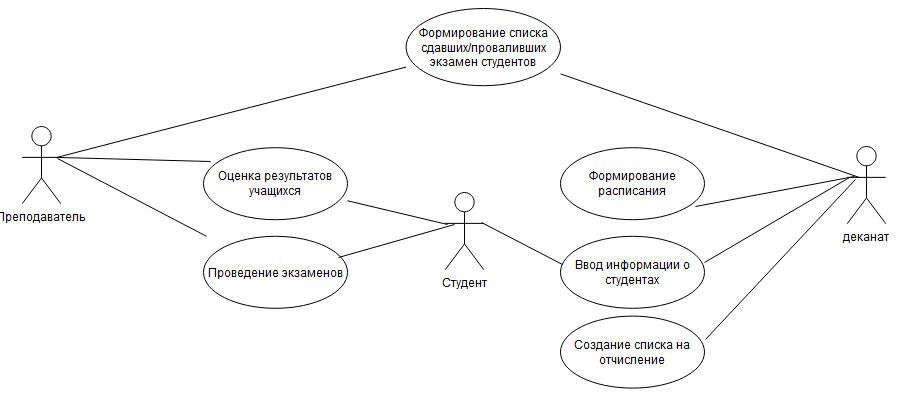

#  Предметная область 
 Деканат — организационный центр по управлению работой факультета, возглавляемый деканом. Деканат выполняет функции координации и административного обеспечения учебного процесса, ведения делопроизводства. В деканате проводится организация учебного процесса в рамках факультета, ведение документации по учету, анализу состава и движения контингента студентов факультета, формирование оперативных данных о деятельности факультета и кафедр.

Целью данной работы является автоматизации учета студентов и их успеваемости, для более быстрой и эффективной работы деканата, для своевременного внесения изменений в учебную карточку студентов.

#  Use case модель
Диаграмма вариантов использования

Диаграмма прецедентов или диаграмма вариантов использования (англ. use case diagram) в UML — диаграмма, отражающая отношения между акторами и прецедентами и являющаяся составной частью модели прецедентов. Ниже представлена диаграмма со следующими объектами:

Студент при обучении в вузе предоставляет всю необходимую информацию деканату, а также взаимодействует с преподавателем при оценке знаний и сдаче экзаменов

Преподаватель оценивает знания студента, проводит экзамены и взаимодействует с деканатом при формировании списка студентов сдавших или проваливших экзамен

Деканат создает список на отчисление по результатам проведения экзаменов, вводит в базу информацию о студентах, формирует расписание занятий и принимает список сдавших и проваливших экзамен студентов у преподавателя

Все отношения приведены ниже:

Рисунок 1 - Диаграмма вариантов использования 
# Создание BPMN модели
BPMN (англ. Business Process Model and Notation, нотация и модель бизнес-процессов) система условных обозначений (нотация) и их описания в XML для моделирования бизнес-процессов.

Спецификация BPMN описывает условные обозначения и их описание в XML для отображения бизнес-процессов в виде диаграмм бизнес-процессов. BPMN ориентирована как на технических специалистов, так и на бизнес- пользователей. Для этого язык использует базовый набор интуитивно понятных элементов, которые позволяют определять сложные семантические конструкции. Кроме того, спецификация BPMN определяет, как диаграммы, описывающие бизнес-процесс, могут быть трансформированы в исполняемые модели. Спецификация BPMN 2.0 также является исполняемой и переносимой (то есть процесс, нарисованный в одном редакторе от одного производителя, может быть исполнен на движке бизнес-процессов совершенно другого производителя, при условии, что они поддерживают BPMN 2.0).

Основная цель BPMN — создание стандартного набора условных обозначений, понятных всем бизнес-пользователям. Бизнес-пользователи включают в себя бизнес-аналитиков, создающих и улучшающих процессы, технических разработчиков, ответственных за реализацию процессов и менеджеров, следящих за процессами и управляющих ими. Следовательно, BPMN призвана служить связующим звеном между фазой дизайна бизнес- процесса и фазой его реализации.

В настоящий момент существует несколько конкурирующих стандартов для моделирования бизнес-процессов. Распространение BPMN поможет унифицировать способы представления базовых концепций бизнес- процессов (например, открытые и частные бизнес-процессы, хореографии), а также более сложные концепции (например, обработка исключительных ситуаций, компенсация транзакций).

Рисунок - 2 Упрощенная общая схема

Рисунок 3 - Детальная диаграмма процесса пересдачи

# Диаграмма базы данных

 Схема «сущность-связь» (также ERD или ER-диаграмма) — это разновидность блок-схемы, где показано, как разные «сущности» (люди, объекты, концепции и так далее) связаны между собой внутри системы. ER-диаграммы чаще всего применяются для проектирования и отладки реляционных баз данных в сфере образования, исследования и разработки программного обеспечения и информационных систем для бизнеса.
 

#  Проблематика предметной области 
Основной проблемой для деканата является учет большого количества студентов из-за чего уменьшается общая производительность работы управляющего органа. Средства автоматизации значительно упростят этот процесс и снизит нагрузку на весь состав сотрудников деканата.
# Сравнительный анализ существующих решений
Для решения существующей проблемы нагрузки на деканат учебная организация может увеличить штат сотрудников, однако данное решение не слишком эффективно из риска человеческих ошибок и дополнительной нагрузки на бюджет. Более оптимальным решением будет использование информационной системы. Такой подход позволит не только снизить нагрузку но и автоматизировать процесс учета, исключить ошибки и ускорить работу деканата.
